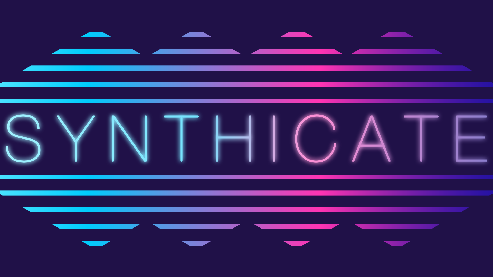

<!-- # Synthicate Game Summary -->

## Overview
Synthicate is a multiplayer virtual board game inspired by Settlers of Catan. In this game, players take on the role of faction leaders that are competing against each other to secure resources in the city of [City Name]. While building up their factions and installing strongholds on these resources, factions will constantly be faced with threats employed by other factions, including hackers, mech takeovers, and bombs. These elements make the gameplay dynamic and encourages players to think careful before planning their cyberpunk empire’s expansion.

## Resources and Territories
Resources are sparse, and when one faction places a stronghold next to certain resources, it secures their supply for the years. People recruited from cities are used to grow and build up the factions. Precious metals harvested from mines are essential to building new technologies, building up outpost and strongholds, and making a little money on the side. Mechs restored from scrapyards are towering robots used to enforce regions and provide the muscle needed to enact control over territories. Power regulated at plants is critical to keeping the factions up and running and keeping subjects reliant on the faction. Food grown in the outlands is pivotal for keeping the faction member well nourished and ready to expand control over the region. All factions try their best to avoid deserts which provide no resources for exploitation.

## Building
Building infrastructure is key to maintaining control over territories in the region. Flyways constructed with power and precious metals provide safe passage of resources for factions. Outposts constructed with metals and power, and fulfilled with food and people are essential to start collecting resources from the neighboring territories. Strongholds are fortified with manpower and mechs to improve resource collection efficiency and solidify control over contested areas.

## Trading
Making compromises with other factions is crucial to survival in this world. Often the positioning of certain factions puts them in positions where trades must be enacted to secure critical resources in order to further expand their control. Trades may often be imbalanced an unfair, but often present unique opportunities for counterplay. If one chooses to avoid trade with other factions, then outpost can be established one spaceports to establish a reliable trading partnership with the astral territories.

## Cyber Actions
Players may choose to use their resources to hire mercenaries and hackers to perform cyber actions. These actions range from shutting down certain territories in the region, to extracting intelligence and resources from other factions. Cyber Actions can be decisive when standoffs occur between factions. Players would be wise to collect as many as possible and enact them to secure their advantage. Cyber actions include:
    - Corporate Espionage: 
        - Allows the user to take all resources of a certain type from every player.
    - Hacker:	
        - Allows the user to hack a person and take resources
        - Prevents everyone from getting resources from a specific territory
        - Removes half of the resources from each player with more than 7 if a Hacker (Skull?) is hashed
    - Influence Card
        - Get one influence point
    - Corruption
        - Take any two resources and add them to your stock
    Havoc cards are also available for a higher cost (and in very limited amounts), and feature some of the following abilities:
    - Total Control: Take all resources from all other players
    - Sabotage: Remove a player’s outpost or stronghold from the region
    - Redistribution: Shuffle the assignments of the hex probabilities

## Bonus Events
Becoming dominant in the core infrastructure of the region provides obvious strategic advantages. Players who employ the most amount of hackers are awarded with bonus points for their proficiency in cyberwarfare. Alternatively, players who focus on their influence and have the longest connection of occupied flyways are awarded a fully connected bonus. 
While playing them game certain events are also prone to occur. Surge events happen when the same number is hashed twice in a row, causing double the amount of resources to be collected from the activated territories. Raid events happen when two hackers are hashed twice in a row, causing all players to lose one of their resources at random. Redistribution occurs randomly with a 5% chance during each hash event. All other chaos events can also occur at random with a 5% chance on each hash event.

## Experimental Features
- Cosmic Abyss / Badlands: Get a random resource each time the territory is activated
 
## Development Logs
- [March 2nd, 2024](../devlogs/synthicate/2024-03-02.html)